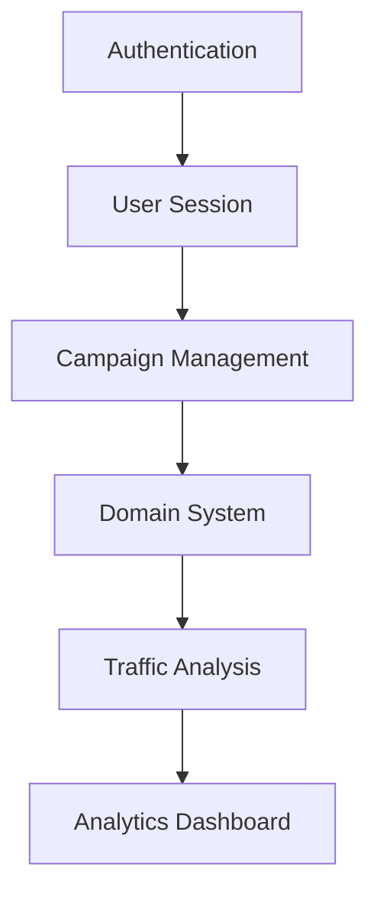

# Implementation Documentation

## Core Features

### 1. Authentication System ✓
- **Status**: Validated
- **Implementation Details**:
  - Uses local storage for demo persistence
  - Supports admin and analyst roles
  - Auto-login for demo purposes
  - Session management with JWT simulation
  - Language selection (English/Spanish)

### 2. User Management ✓
- **Status**: Validated
- **Features**:
  - User roles (admin/analyst)
  - Profile management
  - Settings customization
  - API key management
  - Multi-language support

### 3. Domain Management ✓
- **Status**: Validated
- **Features**:
  - Global domains for all users
  - User-specific domains
  - Domain verification system
  - Default domain selection
  - DNS record management

### 4. Campaign System ✓
- **Status**: Validated
- **Components**:
  - Multi-step wizard with validation
  - Traffic source configuration
  - Parameter mapping
  - URL generation
  - Campaign analytics
  - One-click link copying

### 5. Traffic Analysis ✓
- **Status**: Validated
- **Features**:
  - Real-time statistics
  - Traffic filtering
  - VPN detection
  - Visitor tracking
  - Geographic analysis

## Technical Architecture

### Data Flow


### Key Components

1. **Authentication System**
   - Location: `src/lib/auth.ts`
   - Purpose: User authentication and session management
   - Features:
     - JWT simulation
     - Role-based access
     - Session persistence
     - Language preferences

2. **Domain Management**
   - Location: `src/lib/storage.ts`
   - Purpose: Domain configuration and verification
   - Features:
     - Global domains
     - User domains
     - DNS verification
     - Default domain selection

3. **Campaign System**
   - Location: `src/components/campaign-wizard`
   - Purpose: Campaign creation and management
   - Features:
     - Multi-step wizard
     - Traffic source integration
     - Parameter mapping
     - URL generation
     - Link copying

4. **Traffic Analysis**
   - Location: `src/components/dashboard`
   - Purpose: Traffic monitoring and analysis
   - Features:
     - Real-time stats
     - Traffic filtering
     - VPN detection
     - Geographic analysis

### Security Features

1. **Role-Based Access Control**
   - Admin privileges
   - Analyst restrictions
   - Resource isolation
   - Session management

2. **Domain Security**
   - Domain verification
   - DNS record validation
   - SSL enforcement
   - Default domain protection

3. **Traffic Protection**
   - VPN detection
   - Abnormal traffic filtering
   - Rate limiting
   - IP blocking

## User Roles

### Admin
- Full system access
- Global domain management
- User management
- System settings
- All campaigns access

### Analyst
- Limited to own campaigns
- Own domain management
- Basic analytics
- Profile management

## Data Models

### User
```typescript
interface User {
  id: string;
  email: string;
  role: 'admin' | 'analyst';
  name: string;
}
```

### Domain
```typescript
interface Domain {
  id: string;
  host: string;
  verified: boolean;
  isGlobal?: boolean;
  isDefault?: boolean;
  userId?: string;
}
```

### Campaign
```typescript
interface Campaign {
  id: string;
  name: string;
  domainId: string;
  userId: string;
  status: 'active' | 'paused' | 'draft';
  // ... other properties
}
```

## Storage System

The demo uses a simulated storage system with the following features:

1. **Authentication Storage**
   - JWT token simulation
   - User role persistence
   - Session management
   - Language preferences

2. **Data Storage**
   - In-memory data structures
   - Simulated CRUD operations
   - Data relationship management
   - User-specific data isolation

3. **Access Control**
   - Role-based filtering
   - Resource ownership validation
   - Permission checks
   - Domain access control

## Internationalization

The system supports multiple languages through a context-based translation system:

1. **Language Context**
   - Language selection persistence
   - Real-time language switching
   - Fallback handling

2. **Translation Keys**
   - Organized by feature
   - Support for variables
   - Nested structures
   - Default fallbacks

3. **Language Components**
   - Language selector
   - Translation hooks
   - Automatic direction handling

## Future Enhancements

1. **Authentication**
   - OAuth integration
   - Two-factor authentication
   - SSO support
   - Password recovery

2. **Analytics**
   - Advanced reporting
   - Custom dashboards
   - Export capabilities
   - Real-time alerts

3. **Campaign Management**
   - A/B testing
   - Automated optimization
   - Template system
   - Bulk operations

4. **Security**
   - Enhanced VPN detection
   - Fraud prevention
   - Advanced rate limiting
   - IP reputation system

## Change Log

### Version 0.2.0
- Added internationalization support
- Enhanced authentication system
- Improved link copying functionality
- Added domain management features
- Enhanced security features

### Version 0.1.0
- Initial implementation
- Basic authentication
- Campaign management
- Traffic analysis